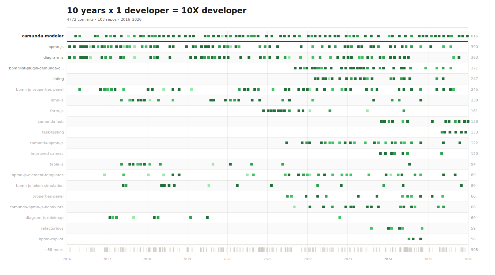

# 10 Years at Camunda

A visualization of 10 years of git history (2016–2026) across the [bpmn-io](https://github.com/bpmn-io) and [camunda](https://github.com/camunda) organizations.

## Preview



## Summary

See the full [anniversary summary](out/anniversary.md) for detailed stats, repo rankings, and fun facts.

**Highlights:**

- 4,615 commits across 106 repos
- 2.2M lines added, 1.1M lines deleted
- Busiest year: 2024 with 678 commits

## Interactive Player

The project includes an animated web player that scrolls through the entire commit history with a GitHub-style contribution visualization.

```bash
npm run dev
```

## Setup

```bash
cp .env.example .env
# Fill in your GitHub token and email addresses
npm install
```

## Scripts

| Script             | Description                                     |
| ------------------ | ----------------------------------------------- |
| `npm run discover` | Discover repos via GitHub API                   |
| `npm run clone`    | Clone all discovered repos locally              |
| `npm run extract`  | Extract commit data from cloned repos           |
| `npm run svg`      | Generate the SVG poster                         |
| `npm run markdown` | Generate the markdown summary                   |
| `npm run generate` | Extract + SVG + markdown in one step            |
| `npm run all`      | Full pipeline: discover + clone + extract + SVG |
| `npm run dev`      | Start the interactive web player                |

## License

MIT
